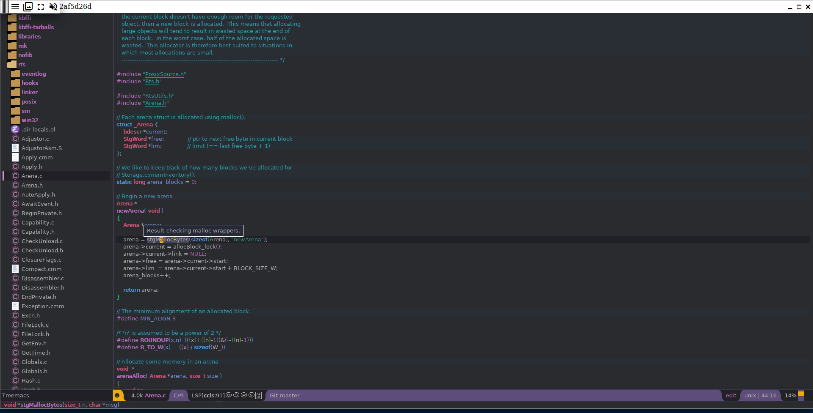
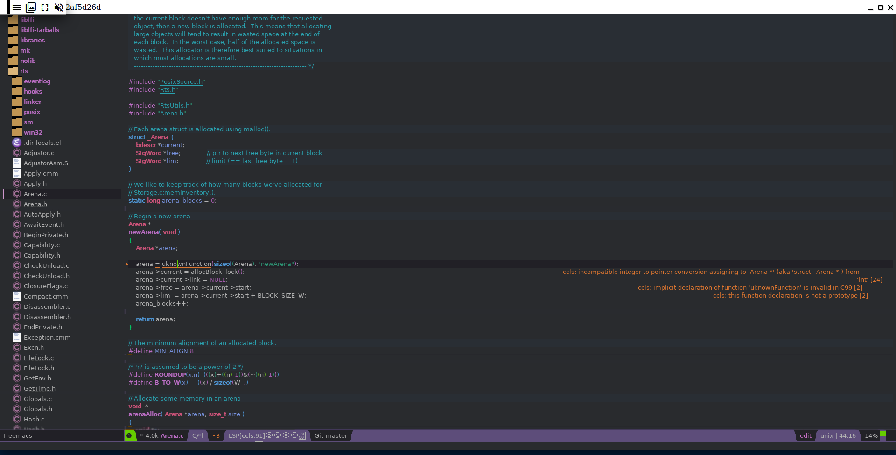

# ghc-spacemacs-docker

This is a showcase how to use the language servers (LSP servers) `ghcide` and
`ccls` with Spacemacs in Docker.

It's not meant for daily work! At least `git` is not correctly configured and
everything happens as `root` user.

You can use the files in `config/` to setup Spacemacs as your GHC IDE. Please see
https://gitlab.haskell.org/ghc/ghc/wikis/spacemacs for details.

The most important part of this little project is to show how to configure
`ghcide` for your local GHC project:

- `config/.spacemacs` contains only as much changes to the Spacemacs template as
  needed.
- `config/ghc` can be seen as an "overlay" to your GHC source folder. Copy these
  files into your GHC source folder according to the directory structure of
  `config/ghc`.

## Usage

### Run
Run `build-and-start-containers.sh` and direct your browser to
http://localhost:10000/index.html?encoding=rgb32&password=111 . This should give
you an in-browser VNC session with Spacemacs.

Open Treemacs with `M-0` and add `/root/ghc/.` as project. Open any Haskell file
under `compiler/`. You will be asked for the workspace root. The default -
`/root/ghc` is fine.

The `ghcide` setup take some time to initialize.

All `*.c` files under `rts` should be supported by `ccls`. Just open one and play a
bit around ... :smiley

Building the images takes a long time. Stay patient: It downloads everything
that's needed to build GHC and later even builds it from scratch.

### Cleanup
Run `cleanup.sh` to remove the two created containers.

### Screenshots

#### Haskell
Information on hover:

Type error:

#### C
Information on hover (Please note the function type in the left corner):

Error (unknown function):

